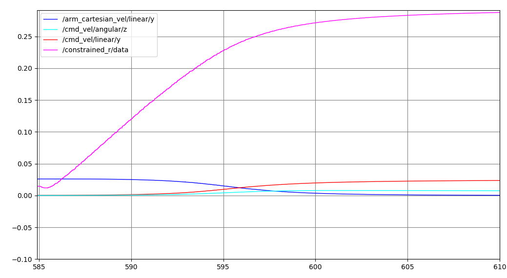

# Velocity Splitter

## Goal

The node takes in the desired **end-effector** velocity (with respect to the **world** and **see/represent in the arm base frame (for linear velocity) and in the end-effector frame (for angular velocity)**), and split it into the **arm cartesial velocity**, support height velocity, and the base velocity.

## How to run

```
rosrun assistive_controller vel_splitter.py
```

If you would like to use the kinematic simulation with rviz, do
```
roslaunch oarbot_description oarbot_rviz.launch
```

You can pose the robot to the home pose in the simulation with the command.
```
rosservice call /go_home
```

## Input Output

### Subscribe

#### Desired End-Effector Velocity

- Topic: desired_vel (geometry_msgs::Twist)
- Description: The desired velocity of the end-effector **with respect to the world** and **represent in the arm base frame/the support frame (for linear velocity) and in the end-effector frame (for angular velocity)**. Please note that which frame the velocity is represent in is very important. 

#### Joint State

- Topic: /joint_state (sensor_msgs::JointState)
- Description: The joint state of the Oarbot. Oarbot is a 10 Dof robot. The 10 axises are *linear x*, *linear y*, *angular z*, *support height in z* and the 6 axis of Kinova arm. In the real set up, *linear x*, *linear y*, *angular z* is the (2D) estimated location (localization) of the Oarbot with respect the world (a map frame you defined).

### Publish

#### Arm Cartesian Velocity

- Topic: arm_cartesian_vel (kinova_msgs::JointVelocity)
- Description: The arm cartesian velocity represent **in the base frame for linear velocity** and **in the end-effector frame for angular velocity**. You can map this topic directly to the cartesian velocity topic of kinova arm.

#### Support Height Velocity

- Topic: sup_vel (std_msgs::Float64)
- Description: 1 DoF support height velocity.

#### Base Velocity

- Topic: cmd_vel (geometry_msgs::Twist)
- Description: The base cartesian velocity represent **in the base footprint frame** (like all mobile robots would defined, e.g. Husky from Clearpath). You can map this topic directly to the car command topic of the base.

## How it works?

The underlying mechanic behind the velocity splitter is using quadratic programming with weighting based on the distance of the end-effector to a pre-defined point. The following descirbed the flow of the node.

### Transform the velocity to the arm base frame
The node first transform the velocity (the angular velocity in particular) to the arm base frame so that all velocity are represented in the same frame.

### Estimate Joint Velocity using Quadratic Programming


The QP try to optimized the above equation. You can see that as the weighting get higher, the respected joint velocity will be lower which then it will decide to use the arm more or the base more.

Since the velocity are represented in the arm base frame, the Jacobian matrix is actually a (J_T)arm_base which means it's the Jacobian matrix of the end-effector represented in the arm base frame. 

### Convert Joint Velocity to Cartisian Velocity

We can then use arm jacobian matrix to convert the joint velocity to the arm cartesian velocity, and also converted the angular velocity to represent in the end-effector frame. The support height velocity is simply the joint velocity. The base velocity is also converted to the base footprint frame.

## Performance Example

The is the result of moving in y direction, i.e. the desired velocity is has a linear y component, from the distance of the end effector to the predefined constrained center ~0.01 m. One can see that the arm velocity approach to 0 as the end-effector goes to the surface of the sphere (the pre-defined constrained distance).




You can see that there's a angular velocity in base. This is because the angular velocity can also cause y-direction linear velocity represented in the arm base frame.

## Debug Hints

1. The constrained sphere center (in the arm base frame) and distance can be adjust in line 80 81.
```
self.control_center = np.array([0.5,0,0.3])
self.control_r = 0.33
```

2. Make sure that the joint state match between how the code realized and the actual robot state. Otherwise different joint state may cause mis calculation of Jacobian matrix and the contrained status.

3. Map the velocities (the arm velocity, the base velocity and support height velocity) to the right topic.
